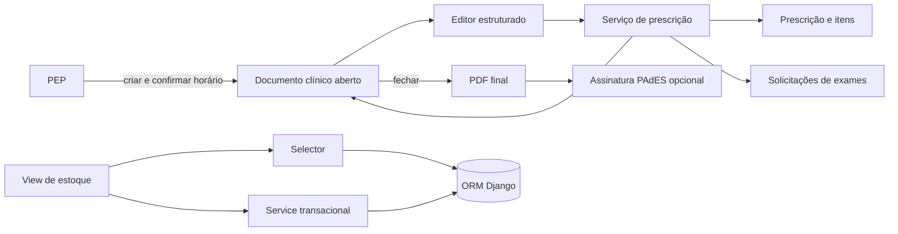

# Modernização da plataforma Celeris

## Diretriz

O Celeris permanece uma aplicação Django modular. A evolução deve reutilizar os domínios existentes, evitar módulos paralelos e mover regras clínicas críticas para serviços transacionais testáveis.

## Diagnóstico atual

- `apps/atendimento/views.py` concentra fluxos de agenda, recepção, PEP, documentos, classificação e painéis.
- O PEP possui um núcleo configurável por `PerfilAssistencial`, `ItemMenuAssistencial` e `ModeloDocumento`.
- `apps/estoque` já é o domínio oficial de produtos, medicamentos, estoques e movimentações; não deve ser duplicado.
- Documentos finais são persistidos como PDF imutável e podem receber assinatura PAdES por certificado A1.
- A navegação é armazenada em `Module` e `ScreenDefinition`, com compatibilidade temporária para definições legadas.

## Decisões arquiteturais

1. **Documento clínico único:** admissão, evolução, receituário e demais registros narrativos usam `ModeloDocumento` + `DocumentoClinico`.
2. **Documentos estruturados:** prescrição de medicamentos e solicitação de exames começam como `DocumentoClinico` aberto, exigem confirmação da data/hora, persistem os itens por serviço e usam o mesmo fechamento/assinatura dos demais documentos.
3. **Estoque único:** medicamentos são produtos de `apps.estoque` com `tp_produto=MEDICAMENTO`.
4. **Assinatura no fechamento:** o PDF final é gerado uma vez, assinado por PAdES quando configurado e persistido sem remontagem posterior.
5. **Transações:** operações que criam cabeçalho e itens são executadas em `transaction.atomic()`.
6. **Compatibilidade:** campos textuais antigos de prescrição e exame permanecem legíveis durante a migração para itens estruturados.
7. **Separação incremental:** novas regras reutilizáveis entram em `services/` e consultas em `selectors/`; views continuam como adaptadores HTTP.

## Domínio de prescrição

- `ClasseItemPrescricao`: agrupa itens, por exemplo `MED` e `EXA`.
- `ViaAplicacaoPrescricao`: mantém vias como VO, IV, IM e SC.
- `ItemPrescricao`: vincula classe, produto, padrões de dose/frequência/duração/posologia.
- `ItemPrescricaoDocumento`: define documentos clínicos obrigatórios por item.
- `PrescricaoItem`: registra exatamente o que foi prescrito no atendimento.
- `apps.atendimento.services.prescricoes`: valida documentos obrigatórios e grava a operação de forma atômica.
- `DocumentoClinico`: controla autoria, horário, trava, estado e versão final assinada da prescrição ou solicitação.

## Arquitetura implementada nesta fase

- Tabelas auxiliares de estoque usam o componente editável padrão do Celeris.
- Estoques e produtos continuam cadastros mestres, pois concentram regras e configurações próprias.
- Quantidades de saldo e reserva não são editadas diretamente; correções devem passar por movimentação/acerto auditável.
- A implementação segue conceitualmente a separação Entity/Service do OFBiz, o dicionário clínico do OpenMRS e os movimentos rastreáveis do OpenBoxes.

## Fases seguintes

1. Extrair documentos, PEP e prescrição de `views.py` para módulos de views e serviços menores.
2. Adicionar estados de dispensação, administração, coleta e resultado com auditoria completa.
3. Integrar saldo/reserva de estoque às prescrições liberadas.
4. Publicar eventos clínicos para notificações em tempo real.
5. Criar adaptadores FHIR sem acoplar o domínio interno ao formato de integração.
6. Ampliar testes de concorrência, assinatura, permissões e recuperação de falhas.

## Requisitos não funcionais

- Toda consulta clínica respeita empresa, perfil e usuário.
- Nenhum certificado ou chave privada é exposto no navegador.
- PDFs assinados devem permanecer verificáveis por leitores compatíveis com PAdES.
- Dados de saúde não devem ser enviados a serviços externos sem contrato, finalidade e consentimento aplicáveis.
- Novas dependências devem ter licença compatível e configuração documentada.
