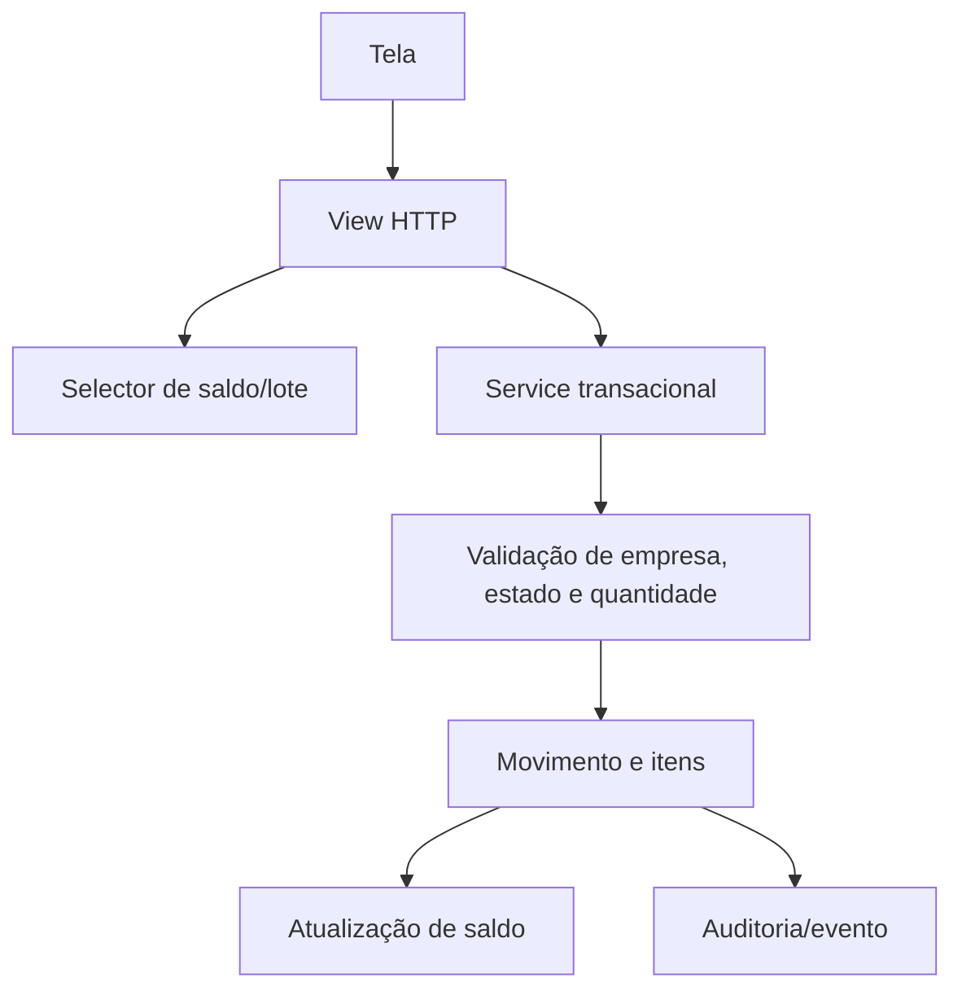

# Arquitetura de estoque e farmácia

## Limites do domínio

`apps/estoque` é a fonte única para produtos, medicamentos, estoques, saldos, cotas, solicitações e movimentações. O PEP referencia produtos desse domínio, mas não altera saldo diretamente.

## Tipos de tela

- **Cadastros mestres:** Estoques e Produtos. Possuem formulário próprio e configurações extensas.
- **Tabelas auxiliares:** Unidades, Classificações, Cotas, motivos, caráter e classes. Usam tabela editável, paginação e consulta padrão.
- **Transações:** entradas, saídas, devoluções, transferências, fracionamentos e acertos. Devem passar por serviços atômicos e gerar rastreabilidade.
- **Consultas operacionais:** saldos e reservas. Quantidades são somente leitura; mínimos e vínculos administrativos podem ser configurados.

## Fluxo recomendado

## Regras

1. Toda operação é restrita à empresa ativa.
2. Saldo nunca é corrigido por edição direta; utilizar movimento de acerto.
3. Lotes futuros devem usar FEFO por validade e manter origem de cada movimentação.
4. Cabeçalho e itens são persistidos na mesma transação.
5. Exclusão lógica é preferida quando o registro já participa de operações.

## Referências conceituais

- OpenBoxes: movimentos, requisições, lotes, validade e rastreabilidade — https://docs.openboxes.com/en/develop/api-guide/outbound/stockMovement/
- Apache OFBiz: separação entre Entity Engine e Service Engine — https://nightlies.apache.org/ofbiz/stable/ofbiz/html5/developer-manual.html

Nenhum código externo foi copiado e nenhuma dependência foi adicionada nesta fase.
