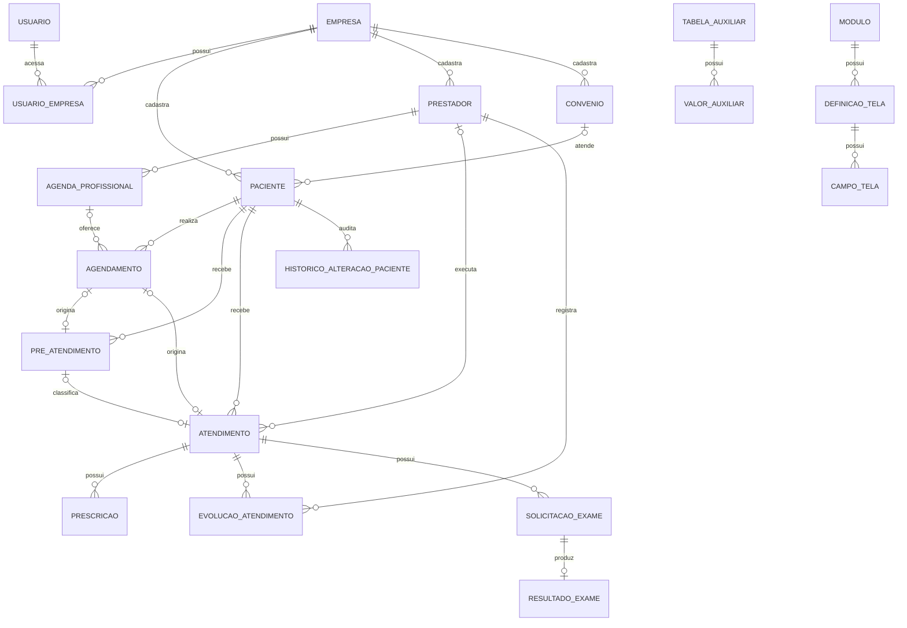

# DER

## Observações

- Campos auxiliares em paciente e prestador ainda são armazenados como códigos textuais; a evolução recomendada é usar chaves estrangeiras para valores auxiliares estáveis.
- Agendamento sem agenda profissional representa demanda espontânea.
- Atendimento pode nascer de um agendamento ou diretamente da recepção.
