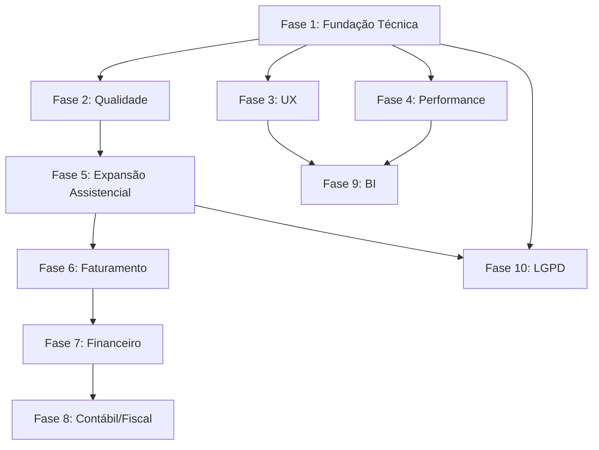

# Roadmap Celeris

Roadmap de desenvolvimento organizado por **prioridade**, **risco** e **dependências**, baseado na análise completa do código-fonte e do estado atual do sistema.

---

## Legenda

| Símbolo | Significado |
|---------|-------------|
| 🔴 Prioridade Crítica | Impede operação segura ou causa perda de dados |
| 🟡 Prioridade Alta | Impacta usabilidade ou manutenibilidade |
| 🟢 Prioridade Média | Melhoria significativa sem bloqueio |
| 🔵 Prioridade Baixa | Nice-to-have / futuro |
| ⚠️ Risco Alto | Pode quebrar funcionalidades existentes |
| ⚡ Risco Médio | Requer testes cuidadosos |
| ✅ Risco Baixo | Mudança isolada e segura |

---

## ✅ Itens já concluídos

| # | Tarefa | Fase original | Concluído em |
|---|--------|--------------|-------------|
| ~~1.3~~ | ~~Aumentar SESSION_COOKIE_AGE~~ — Mantido em 15min por decisão de segurança (dados sensíveis de pacientes) | Fase 1 | Decidido manter |
| ~~1.4~~ | ~~Remover dead code no JS~~ — Bloco `if (false && ...)` em `handleCloseAction` | Fase 1 | ✅ Concluído |
| ~~1.5~~ | ~~Corrigir CSS statusbar~~ — `left: 300px` → `left: 320px` | Fase 1 | ✅ Concluído |

---

## FASE 1 — Fundação Técnica e Segurança (Sprint 1-2)

**Objetivo:** Eliminar vulnerabilidades críticas e garantir operação segura.

| # | Tarefa | Prioridade | Risco | Dependências | Esforço |
|---|--------|-----------|-------|-------------|---------|
| 1.1 | **Forçar SECRET_KEY via ambiente** — Remover fallback hardcoded `"celeris-dev-secret"` e lançar erro se não configurado | 🔴 | ✅ Baixo | Nenhuma | 1h |
| 1.2 | **Alterar DEBUG padrão para False** — Mudar default de `"True"` para `"False"` | 🔴 | ✅ Baixo | Nenhuma | 30min |
| 1.3 | **Adicionar `transaction.atomic()`** em views de tickets, estoque e atendimento que fazem múltiplos saves | 🔴 | ⚡ Médio | Nenhuma | 4h |
| 1.4 | **Corrigir escapeHTML no JS** — Adicionar escape de backticks e outros caracteres | 🟡 | ✅ Baixo | Nenhuma | 30min |
| 1.5 | **Adicionar validação de CSRF** em formulários que estão sem | 🔴 | ⚡ Médio | Nenhuma | 2h |
| 1.6 | **Revisar segurança de sessão** — Verificar se SESSION_COOKIE_SECURE, SESSION_COOKIE_HTTPONLY e SESSION_COOKIE_SAMESITE estão configurados | 🔴 | ✅ Baixo | Nenhuma | 30min |

**Total estimado Fase 1:** ~8h 30min

---

## FASE 2 — Qualidade e Manutenibilidade (Sprint 2-4)

**Objetivo:** Melhorar estrutura do código, cobertura de testes e prevenir regressões.

| # | Tarefa | Prioridade | Risco | Dependências | Esforço |
|---|--------|-----------|-------|-------------|---------|
| 2.1 | **Dividir `apps/atendimento/views.py`** em módulos menores (~10 arquivos) | 🟡 | ⚠️ Alto | Testes existentes | 16h |
| 2.2 | **Criar testes para módulos sem cobertura** (tickets, estoque, enfermagem, social, ti, reports) | 🟡 | ✅ Baixo | Nenhuma | 20h |
| 2.3 | **Adicionar CI/CD (GitHub Actions)** — Rodar testes, lint, check migrations | 🟡 | ✅ Baixo | 2.2 (opcional) | 4h |
| 2.4 | **Adicionar pre-commit hooks** — Black, isort, flake8, eslint | 🟢 | ✅ Baixo | Nenhuma | 2h |
| 2.5 | **Adicionar type hints** em todas as funções Python | 🟢 | ✅ Baixo | Nenhuma | 8h |
| 2.6 | **Adicionar docstrings** em todas as views e models | 🟢 | ✅ Baixo | Nenhuma | 8h |
| 2.7 | **Substituir URLs hardcoded por ``** em templates e navigation.py | 🟡 | ⚡ Médio | Nenhuma | 4h |
| 2.8 | **Remover duplicação do menu "Painéis de Chamada"** na navegação | 🟢 | ✅ Baixo | Nenhuma | 1h |
| 2.9 | **Padronizar roles da navegação** — Usar constantes em vez de strings soltas | 🟡 | ⚡ Médio | Nenhuma | 2h |

**Total estimado Fase 2:** ~65h

---

## FASE 3 — Experiência do Usuário (Sprint 4-6)

**Objetivo:** Melhorar usabilidade, feedback visual e acessibilidade.

| # | Tarefa | Prioridade | Risco | Dependências | Esforço |
|---|--------|-----------|-------|-------------|---------|
| 3.1 | **Adicionar loading states** para operações assíncronas (AJAX, lookup, save) | 🟢 | ✅ Baixo | Nenhuma | 6h |
| 3.2 | **Criar páginas de erro customizadas** (403, 404, 500) | 🟢 | ✅ Baixo | Nenhuma | 4h |
| 3.3 | **Adicionar confirmação em ações destrutivas** (exclusão de registros, desativação) | 🟢 | ✅ Baixo | Nenhuma | 4h |
| 3.4 | **Melhorar acessibilidade** — ARIA labels, foco visível, contraste, navegação por teclado | 🟢 | ✅ Baixo | Nenhuma | 8h |
| 3.5 | **Adicionar suporte mobile responsivo** — Media queries no CSS | 🔵 | ⚡ Médio | Nenhuma | 12h |
| 3.6 | **Adicionar paginação consistente** em todas as listagens | 🟢 | ⚡ Médio | Nenhuma | 6h |
| 3.7 | **Adicionar busca full-text** nos campos de texto (PostgreSQL search vector) | 🟢 | ⚡ Médio | Migração PostgreSQL | 8h |
| 3.8 | **Adicionar exportação CSV/Excel** em todas as tabelas | 🟢 | ✅ Baixo | Nenhuma | 6h |

**Total estimado Fase 3:** ~54h

---

## FASE 4 — Performance e Infraestrutura (Sprint 6-8)

**Objetivo:** Garantir performance adequada para produção com múltiplos usuários.

| # | Tarefa | Prioridade | Risco | Dependências | Esforço |
|---|--------|-----------|-------|-------------|---------|
| 4.1 | **Adicionar índices compostos** nas tabelas mais consultadas (atendimento, agendamento, ticket) | 🟡 | ⚡ Médio | Nenhuma | 4h |
| 4.2 | **Implementar caching** (Redis/Memcached) para consultas frequentes | 🟢 | ⚡ Médio | Redis instalado | 8h |
| 4.3 | **Adicionar lazy loading** para iframes e imagens | 🟢 | ✅ Baixo | Nenhuma | 2h |
| 4.4 | **Implementar health check endpoint** para monitoramento | 🟢 | ✅ Baixo | Nenhuma | 2h |
| 4.5 | **Adicionar logging estruturado** em pontos críticos (login, save, delete) | 🟢 | ✅ Baixo | Nenhuma | 4h |
| 4.6 | **Otimizar queries N+1** — Revisar select_related/prefetch_related | 🟡 | ⚡ Médio | Nenhuma | 8h |

**Total estimado Fase 4:** ~28h

---

## FASE 5 — Expansão Assistencial (Sprint 8-12)

**Objetivo:** Completar ciclo assistencial com prescrição, medicação e exames.

| # | Tarefa | Prioridade | Risco | Dependências | Esforço |
|---|--------|-----------|-------|-------------|---------|
| 5.1 | **Prescrição estruturada** — Medicamentos com via, frequência, duração, orientações | 🟡 | ⚡ Médio | Fase 1, 2 | 20h |
| 5.2 | **Aprazamento de medicamentos** — Horários, checagem, suspensão | 🟡 | ⚡ Médio | 5.1 | 16h |
| 5.3 | **Evolução médica completa** — Anamnese, hipótese diagnóstica, CID, conduta | 🟡 | ⚡ Médio | Fase 1, 2 | 16h |
| 5.4 | **Solicitação de exames** — Integração com laboratório, imagem | 🟢 | ⚡ Médio | 5.3 | 12h |
| 5.5 | **Laudo e liberação de exames** — Resultados, assinatura digital | 🟢 | ⚠️ Alto | 5.4 | 20h |
| 5.6 | **Evoluir editor de documentos** — Componentes estruturados, assinatura digital, versionamento | 🟢 | ⚡ Médio | Fase 1 | 16h |

**Total estimado Fase 5:** ~100h

---

## FASE 6 — Faturamento e Convênios (Sprint 12-16)

**Objetivo:** Implementar ciclo de faturamento de convênios e particular.

| # | Tarefa | Prioridade | Risco | Dependências | Esforço |
|---|--------|-----------|-------|-------------|---------|
| 6.1 | **Parametrização de contratos e planos** — Tabelas de preço, pacotes, regras | 🟡 | ⚡ Médio | Fase 1, 2 | 16h |
| 6.2 | **Geração de conta do atendimento** — Consultas, exames, procedimentos, materiais | 🟡 | ⚠️ Alto | 5.1, 5.4 | 24h |
| 6.3 | **Conferência e auditoria de contas** — Glosas, ajustes | 🟢 | ⚡ Médio | 6.2 | 16h |
| 6.4 | **Fechamento e envio** — XML/TISS, arquivo de cobrança | 🟢 | ⚠️ Alto | 6.3 | 20h |
| 6.5 | **Controle de guias e autorizações** — Elegibilidade, recurso de glosa | 🟢 | ⚡ Médio | 6.1 | 12h |

**Total estimado Fase 6:** ~88h

---

## FASE 7 — Financeiro (Sprint 16-20)

**Objetivo:** Implementar contas a receber, contas a pagar e fluxo de caixa.

| # | Tarefa | Prioridade | Risco | Dependências | Esforço |
|---|--------|-----------|-------|-------------|---------|
| 7.1 | **Contas a receber** — Particular, convênio, pacote, coparticipação | 🟡 | ⚠️ Alto | 6.2 | 20h |
| 7.2 | **Contas a pagar** — Fornecedores, compras, contratos, impostos | 🟢 | ⚡ Médio | Nenhuma | 16h |
| 7.3 | **Caixa e conciliação bancária** — Formas de pagamento, repasses | 🟢 | ⚡ Médio | 7.1, 7.2 | 16h |
| 7.4 | **Fluxo de caixa e inadimplência** — Relatórios gerenciais | 🔵 | ⚡ Médio | 7.1 | 12h |

**Total estimado Fase 7:** ~64h

---

## FASE 8 — Contábil e Fiscal (Sprint 20-24)

**Objetivo:** Integração contábil e fiscal.

| # | Tarefa | Prioridade | Risco | Dependências | Esforço |
|---|--------|-----------|-------|-------------|---------|
| 8.1 | **Plano de contas e centros de custo** — Natureza financeira, rateios | 🔵 | ⚡ Médio | 7.1, 7.2 | 12h |
| 8.2 | **Integração financeiro-contábil** — Eventos de recebimento, pagamento, faturamento | 🔵 | ⚠️ Alto | 8.1 | 20h |
| 8.3 | **Documentos fiscais** — Notas, impostos, retenções, exportações | 🔵 | ⚠️ Alto | 8.2 | 20h |
| 8.4 | **Fechamento mensal** — Conciliações, travas por competência, relatórios | 🔵 | ⚡ Médio | 8.3 | 12h |

**Total estimado Fase 8:** ~64h

---

## FASE 9 — Indicadores e BI (Sprint 24-26)

**Objetivo:** Dashboards operacionais e gerenciais.

| # | Tarefa | Prioridade | Risco | Dependências | Esforço |
|---|--------|-----------|-------|-------------|---------|
| 9.1 | **Painéis operacionais** — Agendamento, recepção, fila, atendimento | 🟢 | ✅ Baixo | Fase 1, 2 | 12h |
| 9.2 | **Indicadores de produção** — Tempo de espera, absenteísmo, produção por prestador | 🟢 | ✅ Baixo | 9.1 | 12h |
| 9.3 | **Indicadores financeiros** — Receita, custo, glosas, inadimplência | 🔵 | ✅ Baixo | 7.1, 7.2 | 12h |
| 9.4 | **Auditoria de alterações** — Interface de consulta de logs por tabela, usuário, data | 🟢 | ✅ Baixo | Nenhuma | 8h |

**Total estimado Fase 9:** ~44h

---

## FASE 10 — LGPD e Governança (Sprint 26-28)

**Objetivo:** Adequação completa à LGPD.

| # | Tarefa | Prioridade | Risco | Dependências | Esforço |
|---|--------|-----------|-------|-------------|---------|
| 10.1 | **Consentimento do paciente** — Termo, finalidade, revogação | 🟡 | ⚡ Médio | Nenhuma | 8h |
| 10.2 | **Logs de acesso a dados pessoais** — Quem acessou, quando, qual dado | 🟡 | ⚡ Médio | Nenhuma | 8h |
| 10.3 | **Anonimização e exportação de dados** — Direito do titular | 🟢 | ⚡ Médio | Nenhuma | 8h |
| 10.4 | **Política de senhas forte** — Complexidade, histórico, MFA opcional | 🟡 | ✅ Baixo | Nenhuma | 6h |
| 10.5 | **Rate limiting no login** — Prevenir brute force | 🟡 | ✅ Baixo | Nenhuma | 4h |

**Total estimado Fase 10:** ~34h

---

## Resumo de esforço por fase

| Fase | Horas estimadas | Sprints | Prioridade |
|------|----------------|---------|-----------|
| **Fase 1** — Fundação Técnica | ~8h 30min | 1-2 | 🔴 Crítica |
| **Fase 2** — Qualidade | ~65h | 2-4 | 🟡 Alta |
| **Fase 3** — UX | ~54h | 4-6 | 🟢 Média |
| **Fase 4** — Performance | ~28h | 6-8 | 🟡 Alta |
| **Fase 5** — Expansão Assistencial | ~100h | 8-12 | 🟡 Alta |
| **Fase 6** — Faturamento | ~88h | 12-16 | 🟡 Alta |
| **Fase 7** — Financeiro | ~64h | 16-20 | 🟢 Média |
| **Fase 8** — Contábil/Fiscal | ~64h | 20-24 | 🔵 Baixa |
| **Fase 9** — BI/Indicadores | ~44h | 24-26 | 🟢 Média |
| **Fase 10** — LGPD | ~34h | 26-28 | 🟡 Alta |
| **Total** | **~541h 30min** | **28 sprints** | |

---

## Dependências entre fases

---

## Recomendações para início imediato

1. **Configurar .env em produção** com SECRET_KEY forte, DEBUG=False e ALLOWED_HOSTS
2. **Adicionar `transaction.atomic()`** nas views de tickets (prioridades, oficinas, usuario_oficina)
3. **Configurar cookies de sessão seguros** — Adicionar `SESSION_COOKIE_SECURE=True`, `SESSION_COOKIE_HTTPONLY=True` e `SESSION_COOKIE_SAMESITE='Lax'` em produção
4. **Criar testes para tickets** antes de qualquer refatoração
5. **Corrigir escapeHTML** no JavaScript para prevenir XSS

---

## Notas

- **SESSION_COOKIE_AGE** mantido em **15 minutos (900s)** por decisão de segurança devido à natureza sensível dos dados de pacientes
- Cada sprint = 1 semana (assumindo ~20h/semana de desenvolvimento)
- Estimativas são aproximadas e devem ser ajustadas conforme a equipe
- Fases podem sobrepor se houver múltiplos desenvolvedores
- Testes devem ser escritos **antes** de refatorações (Fase 2)
- A Fase 1 pode ser concluída em **1-2 dias** e já entrega ganhos significativos de segurança